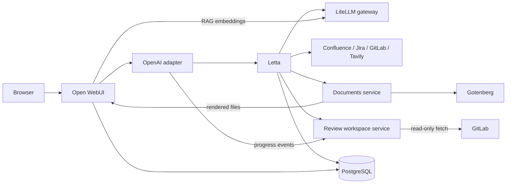

# Letta + Open WebUI

A self-hosted AI workspace that combines persistent [Letta](https://www.letta.com/)
agents with [Open WebUI](https://openwebui.com/), a shared PostgreSQL/PGVector
backend, declarative agent tooling, and a Markdown-first document renderer.

The stack is designed for a private, single-host deployment. Its public entry
points bind to `127.0.0.1` by default, application data lives in named Docker
volumes, and model and embedding requests go through an external
OpenAI-compatible LiteLLM gateway.

## What is included

| Service | Purpose | Host access |
| --- | --- | --- |
| `open-webui` | Browser chat UI, uploads, and RAG | <http://127.0.0.1:3000> |
| `letta` | Persistent agent runtime and API | <http://127.0.0.1:8283> |
| `letta-openai` | Presents visible Letta agents as OpenAI-compatible models | Internal only |
| `postgres` | Separate Letta and Open WebUI databases, both with PGVector | Internal only |
| `documents` | Stores Markdown and renders DOCX, PDF, HTML, ODT, and text | Internal only |
| `gotenberg` | Converts office documents to PDF with LibreOffice | Internal only |
| `review` | Owns ephemeral pinned repository workspaces and review progress | Internal only |

The bundled assets add three user-facing agents:

- `engineering-assistant` routes work to small, medium, or large engineering
  workers and can use Tavily for web research.
- `office-agent` coordinates bounded Confluence, Jira, GitLab, and document
  specialists, then delegates analysis to an engineering worker.
- `code-review-agent` reviews a GitLab merge request against its diff and the
  Jira and Confluence context named by its branch, then stages and publishes
  review comments only after two separate confirmations.

Specialist and worker agents are tagged `openwebui-hidden`, so only the three
manager agents appear in Open WebUI's model picker.

## Architecture



Chat traffic reaches Letta through the compatibility adapter. RAG embedding
traffic does not: both Letta and Open WebUI send embeddings directly to
LiteLLM using `openai/text-embedding-3-small`.

The review service shares a dedicated network only with Letta and the adapter.
It cannot resolve PostgreSQL, Open WebUI, or the documents service, and it
receives a GitLab token scoped to `read_repository` rather than the token used
to post comments.

## Requirements

- Docker Engine with the `docker compose` plugin
- Python 3.10 or newer for the asset bootstrap script
- An OpenAI-compatible LiteLLM endpoint and API key
- Access through that gateway to `openai/text-embedding-3-small`

To install all bundled agent manifests, Letta's synchronized provider catalog
must also contain these model handles:

- `openai-proxy/openai/gpt-5.6-luna`
- `openai-proxy/openai/gpt-5.6-terra`
- `openai-proxy/openai/gpt-5.6-sol`
- `openai-proxy/google/gemini-3.7-flash`
- `openai-proxy/anthropic/claude-opus-5`
- `openai-proxy/anthropic/claude-sonnet-5`

## Quick start

1. Create the local configuration file:

   ```sh
   cp .env.example .env
   ```

2. Edit `.env` and replace the placeholders. At minimum, configure the three
   PostgreSQL passwords, LiteLLM URL and key, Letta API and encryption keys,
   document API key, and Open WebUI secret key. Generate independent random
   values for every password or secret; for example, run this once per value:

   ```sh
   openssl rand -hex 32
   ```

   Keep `LETTA_ENCRYPTION_KEY` and `WEBUI_SECRET_KEY` stable after the first
   deployment. Changing them can invalidate encrypted provider data or user
   sessions.

3. Validate and start the seven services:

   ```sh
   docker compose config --quiet
   docker compose up -d --build
   docker compose ps
   ```

   Wait until every service reports `healthy`. The initial image downloads and
   local service builds can take several minutes.

4. Open <http://127.0.0.1:3000> and create the first Open WebUI account. To
   enable downloadable document renders, create an API key under
   **Settings → Account**, set `OPENWEBUI_API_KEY` in `.env`, and recreate the
   documents service:

   ```sh
   docker compose up -d documents
   ```

5. Set a real `TAVILY_MCP_URL` in `.env`, confirm that the required model
   handles are available through LiteLLM, and register the bundled assets:

   ```sh
   ./letta-assets/bootstrap
   ```

   Bootstrap is idempotent: rerunning it updates resources by name, refreshes
   MCP tools, and preserves writable agent memory. It does not delete remote
   resources merely because a local manifest was removed.

6. Refresh Open WebUI and select `engineering-assistant`, `office-agent`, or
   `code-review-agent`.

Confluence, Jira, and GitLab credentials are only needed when those integrations
are used. Their tools can be registered before valid credentials are supplied,
but calls will fail until the matching `.env` values are configured and the
`letta` service is recreated. Repository-backed code reviews additionally need
`GITLAB_WORKSPACE_TOKEN` and the `review` service recreated.

## Configuration

All secrets belong in the ignored `.env` file. `.env.example` documents every
supported setting without containing working credentials.

### Core settings

| Variable | Description |
| --- | --- |
| `LITELLM_BASE_URL`, `LITELLM_API_KEY` | OpenAI-compatible model and embedding gateway |
| `LETTA_API_KEY` | Protects Letta and authenticates the local adapter and routing tool |
| `LETTA_ENCRYPTION_KEY` | Stable key used to encrypt provider secrets at rest |
| `WEBUI_SECRET_KEY` | Stable Open WebUI session-signing secret |
| `POSTGRES_PASSWORD` | PostgreSQL administrator password |
| `LETTA_DB_PASSWORD` | Password for the dedicated `letta` role and database |
| `OPENWEBUI_DB_PASSWORD` | Password for the dedicated `openwebui` role and database |

### Integrations and documents

| Variable | Description |
| --- | --- |
| `TAVILY_MCP_URL` | Complete credential-bearing URL for the Tavily MCP server |
| `CONFLUENCE_*` | Confluence base URL, access token, and optional auth mode |
| `JIRA_*` | Jira base URL, access token, and auth mode |
| `GITLAB_BASE_URL`, `GITLAB_ACCESS_TOKEN` | GitLab site root and operator token used by comment tools |
| `GITLAB_WORKSPACE_TOKEN` | Separate GitLab token scoped only to `read_repository` |
| `REVIEW_API_KEY` | Shared secret between Letta, the adapter, and the review service |
| `DOCUMENTS_API_KEY` | Shared secret between Letta and the documents service |
| `OPENWEBUI_API_KEY` | Lets the documents service upload finished renders to Open WebUI |
| `DOCUMENTS_PUBLIC_BASE_URL` | Browser-visible Open WebUI origin used in download links |

See [.env.example](.env.example) for accepted values and authentication-mode
details. Credential changes only reach a container after it is recreated with
`docker compose up -d <service>`.

### Network access

Letta and Open WebUI bind only to localhost by default. For a trusted LAN or a
reverse proxy, set `LETTA_BIND_ADDRESS`, `OPENWEBUI_BIND_ADDRESS`, and
`OPENWEBUI_ORIGIN` deliberately. Do not expose the services directly to an
untrusted network; terminate TLS and enforce access controls at the proxy.

## Verify the deployment

Check container health and logs:

```sh
docker compose ps
docker compose logs --tail=100 letta open-webui letta-openai documents review
```

Confirm that the required embedding routes have not drifted:

```sh
docker compose exec -T letta python -c \
  'from letta.settings import settings; print(settings.default_embedding_handle)'

docker compose exec -T open-webui python -c \
  'import os; print(os.environ.get("RAG_EMBEDDING_ENGINE")); print(os.environ.get("RAG_EMBEDDING_MODEL"))'
```

Expected output:

```text
openai/text-embedding-3-small
openai
openai/text-embedding-3-small
```

Check both document-rendering services:

```sh
docker compose exec -T documents curl -fsS http://localhost:8090/health
docker compose exec -T documents curl -fsS http://gotenberg:3000/health
docker compose exec -T review curl -fsS http://localhost:8091/health
docker compose exec -T letta curl -fsS http://review:8091/health
```

## Declarative agents and tools

[`letta-assets/`](letta-assets/) is the source of truth for resources managed
by this repository:

```text
letta-assets/
├── agents/          Agent manifests, prompts, memory, tags, and tool grants
├── mcp-servers/     Remote MCP server manifests
├── tools/           Standard-library-only custom Letta tools
├── bootstrap        Idempotent registration script
└── README.md        Detailed asset and extension guide
```

MCP servers are synchronized before agents so manifests can refer to stable
server and tool names. Tools are attached only when an agent manifest requests
them, and bootstrap never removes tools that were attached outside this
workflow.

For adding agents, MCP servers, or Python tools, and for details of the routing
and permission model, read the [Letta assets guide](letta-assets/README.md).

## Code review workflow

`code-review-agent` reviews a GitLab merge request without running any
repository code. For medium and deep reviews—and whenever GitLab withholds a
patch—it receives a disposable clone pinned to the reviewed head SHA. The
minimal review image has no project runtime or toolchain, disables hooks,
submodules, LFS filters, and repository-selected protocols, and uses a separate
read-only GitLab credential.

A review runs in three turns, with a confirmation gate before each write:

1. **Review.** The GitLab specialist returns the merge request's `diff_refs`,
   its changed-file list, and a coverage count, but not the diff itself: the
   analyst reads that from the same tool directly, so the lines it anchors to are
   the ones a tool returned rather than a copy retyped through two agents. A
   review record is opened next; it owns an optional workspace fetched from the
   merge-request ref and rejects a moved `head_sha` as stale. The context
   specialist matches a `KEY-NUMBER` ticket id in the source branch
   against the real Jira project keys, then reads that story, its parent epic,
   and up to two Confluence pages linked from either, listing every page it
   found. The analyst turns both into a findings packet, using `workspace_diff`
   to recover real old/new line anchors for patches GitLab withheld and search
   to inspect related callers before speculating. The workspace is discarded
   immediately after analysis and before the first human gate. Nothing is
   written to GitLab.
2. **Stage.** After you confirm, each selected anchored finding becomes an
   unpublished draft note. A finding that could not be tied to a diff line is not
   stageable and appears in the summary note at publication instead. Draft notes are visible only to their author, so you can review
   the exact anchoring in GitLab's diff view and discard anything wrong.
3. **Publish.** After a second, separate confirmation, the drafts are published
   as one review with a summary note and a reviewer state.

Comments are authored by the account owning `GITLAB_ACCESS_TOKEN`; there is no
separate bot identity, which is why the summary note carries a footer marking
the review as machine-assisted. The agent cannot approve or merge a merge
request, and both `head_sha` checks abort the flow if the author pushes new
commits mid-review, since every stored line anchor would then be stale. The
analyst performs the same check when it fetches the diff, so a push during the
read-only turn is caught before any finding is shown.

The review states how much of the change it actually saw. Every diff read is
capped, so the tool reports the files and lines it returned, the lines it
dropped, and whether another page exists; the analyst pages through the rest
within a fixed budget and lists whatever remains under what was not reviewed. A
gap in the evidence is reported as a gap, never as a finding about the code.

Workspace limits are enforced by the service: 25 reads per review, four
searches, 2,000 lines per file read, 200 matches per search, and ten seconds per
Git subprocess. Files matching secret-like names such as `.env*`, private-key
formats, and keystores are withheld server-side. A line from a file, search, or
blame response is context only; only GitLab's diff tool and `workspace_diff`
produce valid comment anchors.

Progress is reported while the work runs. In native mode the adapter derives
start and completion beats from actual routing events, including elapsed time,
and interleaves factual worker milestones from the review event log. They use
Open WebUI's collapsible reasoning channel, so the final message contains only
the review. Set `PROXY_STREAM_MODE=openai` to restore the previous
chat-completions path if native streaming needs to be disabled during a deploy.

Cleanup has three layers: closing the review record discards its owned
workspace, a 45-minute TTL reaper handles interrupted sessions, and fixed
concurrent/byte capacity refuses new clones rather than evicting a live one.

## Document workflow

Markdown is the source of truth for every stored document. DOCX, PDF, HTML,
ODT, and plain-text files are content-addressed render artifacts. PDF output is
derived from DOCX through Gotenberg so paired downloads stay visually aligned.

The Letta document tools use only Python's standard library and exchange
document IDs and URLs with the internal documents service. Pandoc, styling,
LibreOffice conversion, and binary storage remain isolated in the rendering
containers. The default `openwebui` delivery mode uploads completed files to
the Open WebUI account that owns `OPENWEBUI_API_KEY` rather than publishing the
documents service.

More details, including the alternative capability-link delivery mode, are in
the [asset guide](letta-assets/README.md#bootstrap).

## Data and lifecycle

Persistent state is stored in five named volumes:

| Volume | Contents |
| --- | --- |
| `postgres_data` | Both application databases, owned by separate roles |
| `letta_data` | Letta filesystem state |
| `openwebui_data` | Open WebUI uploads, cache files, and local assets |
| `documents_data` | Markdown sources and rendered documents |
| `review_data` | Small review/event records and live ephemeral workspaces |

Common operations:

```sh
# Apply configuration or image changes
docker compose up -d --build

# Follow service logs
docker compose logs -f

# Stop containers while preserving all named volumes
docker compose down
```

Do not run `docker compose down -v` unless you intend to permanently delete
the databases, agents, uploads, documents, and review records. Back up the
named volumes before host migration or destructive maintenance.

## Development checks

Validate the deployment definition, bootstrap code, and JSON manifests without
printing resolved secrets:

```sh
docker compose config --quiet
python3 -m py_compile letta-assets/bootstrap

for manifest in letta-assets/agents/*.json letta-assets/mcp-servers/*.json; do
  python3 -m json.tool "$manifest" >/dev/null
done

python3 -m unittest discover -s tests
```

The repository intentionally pins published container images by digest.
`documents/` and `review/` are the only locally built images. Each pins its
base image digest in its Dockerfile.

## Troubleshooting

**Bootstrap reports that a model or embedding handle is missing.** Check the
LiteLLM `/models` response and Letta provider-sync logs. Fix the gateway catalog
instead of replacing `openai/text-embedding-3-small` with a local model.

**No agents appear in Open WebUI.** Confirm that bootstrap completed, then
check `letta-openai` logs. The adapter lists Letta agents as models and filters
only agents carrying the `openwebui-hidden` tag.

**Document rendering works but the download fails.** Verify
`OPENWEBUI_API_KEY` and `DOCUMENTS_PUBLIC_BASE_URL`, then recreate `documents`.
The public base URL must match the origin used in the browser.

**An integration tool returns an authentication error.** Verify the matching
base URL, token, and auth mode in `.env`, then recreate `letta`. Never place
credentials directly in an agent, MCP, or tool manifest. Repository fetching
specifically requires `GITLAB_WORKSPACE_TOKEN` with `read_repository`; do not
reuse the broader comment-writing token.

**A service remains unhealthy.** Inspect it with
`docker compose logs --tail=200 <service>`. PostgreSQL must be healthy before
Letta starts, Letta before the adapter, Gotenberg before the documents service,
and the review service before Letta's review tools become usable.
