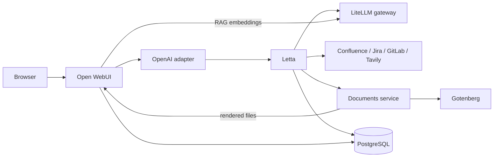

# Letta + Open WebUI

A self-hosted AI workspace that combines persistent [Letta](https://www.letta.com/)
agents with [Open WebUI](https://openwebui.com/), a shared PostgreSQL/PGVector
backend, declarative agent tooling, and a Markdown-first document renderer.

The stack is designed for a private, single-host deployment. Its public entry
points bind to `127.0.0.1` by default, application data lives in named Docker
volumes, and model and embedding requests go through an external
OpenAI-compatible LiteLLM gateway.

## What is included

| Service | Purpose | Host access |
| --- | --- | --- |
| `open-webui` | Browser chat UI, uploads, and RAG | <http://127.0.0.1:3000> |
| `letta` | Persistent agent runtime and API | <http://127.0.0.1:8283> |
| `letta-openai` | Presents visible Letta agents as OpenAI-compatible models | Internal only |
| `postgres` | Separate Letta and Open WebUI databases, both with PGVector | Internal only |
| `documents` | Stores Markdown and renders DOCX, PDF, HTML, ODT, and text | Internal only |
| `gotenberg` | Converts office documents to PDF with LibreOffice | Internal only |

The bundled assets add two user-facing agents:

- `engineering-assistant` routes work to small, medium, or large engineering
  workers and can use Tavily for web research.
- `office-agent` coordinates bounded Confluence, Jira, GitLab, and document
  specialists, then delegates analysis to an engineering worker.

Specialist and worker agents are tagged `openwebui-hidden`, so only the two
manager agents appear in Open WebUI's model picker.

## Architecture



Chat traffic reaches Letta through the compatibility adapter. RAG embedding
traffic does not: both Letta and Open WebUI send embeddings directly to
LiteLLM using `openai/text-embedding-3-small`.

## Requirements

- Docker Engine with the `docker compose` plugin
- Python 3.10 or newer for the asset bootstrap script
- An OpenAI-compatible LiteLLM endpoint and API key
- Access through that gateway to `openai/text-embedding-3-small`

To install all bundled agent manifests, Letta's synchronized provider catalog
must also contain these model handles:

- `openai-proxy/openai/gpt-5.6-luna`
- `openai-proxy/openai/gpt-5.6-terra`
- `openai-proxy/openai/gpt-5.6-sol`
- `openai-proxy/google/gemini-3.7-flash`

## Quick start

1. Create the local configuration file:

   ```sh
   cp .env.example .env
   ```

2. Edit `.env` and replace the placeholders. At minimum, configure the three
   PostgreSQL passwords, LiteLLM URL and key, Letta API and encryption keys,
   document API key, and Open WebUI secret key. Generate independent random
   values for every password or secret; for example, run this once per value:

   ```sh
   openssl rand -hex 32
   ```

   Keep `LETTA_ENCRYPTION_KEY` and `WEBUI_SECRET_KEY` stable after the first
   deployment. Changing them can invalidate encrypted provider data or user
   sessions.

3. Validate and start the six services:

   ```sh
   docker compose config --quiet
   docker compose up -d --build
   docker compose ps
   ```

   Wait until every service reports `healthy`. The initial image download and
   documents image build can take several minutes.

4. Open <http://127.0.0.1:3000> and create the first Open WebUI account. To
   enable downloadable document renders, create an API key under
   **Settings → Account**, set `OPENWEBUI_API_KEY` in `.env`, and recreate the
   documents service:

   ```sh
   docker compose up -d documents
   ```

5. Set a real `TAVILY_MCP_URL` in `.env`, confirm that the required model
   handles are available through LiteLLM, and register the bundled assets:

   ```sh
   ./letta-assets/bootstrap
   ```

   Bootstrap is idempotent: rerunning it updates resources by name, refreshes
   MCP tools, and preserves writable agent memory. It does not delete remote
   resources merely because a local manifest was removed.

6. Refresh Open WebUI and select `engineering-assistant` or `office-agent`.

Confluence, Jira, and GitLab credentials are only needed when those integrations
are used. Their tools can be registered before valid credentials are supplied,
but calls will fail until the matching `.env` values are configured and the
`letta` service is recreated.

## Configuration

All secrets belong in the ignored `.env` file. `.env.example` documents every
supported setting without containing working credentials.

### Core settings

| Variable | Description |
| --- | --- |
| `LITELLM_BASE_URL`, `LITELLM_API_KEY` | OpenAI-compatible model and embedding gateway |
| `LETTA_API_KEY` | Protects Letta and authenticates the local adapter and routing tool |
| `LETTA_ENCRYPTION_KEY` | Stable key used to encrypt provider secrets at rest |
| `WEBUI_SECRET_KEY` | Stable Open WebUI session-signing secret |
| `POSTGRES_PASSWORD` | PostgreSQL administrator password |
| `LETTA_DB_PASSWORD` | Password for the dedicated `letta` role and database |
| `OPENWEBUI_DB_PASSWORD` | Password for the dedicated `openwebui` role and database |

### Integrations and documents

| Variable | Description |
| --- | --- |
| `TAVILY_MCP_URL` | Complete credential-bearing URL for the Tavily MCP server |
| `CONFLUENCE_*` | Confluence base URL, access token, and optional auth mode |
| `JIRA_*` | Jira base URL, access token, and auth mode |
| `GITLAB_*` | GitLab site root and access token |
| `DOCUMENTS_API_KEY` | Shared secret between Letta and the documents service |
| `OPENWEBUI_API_KEY` | Lets the documents service upload finished renders to Open WebUI |
| `DOCUMENTS_PUBLIC_BASE_URL` | Browser-visible Open WebUI origin used in download links |

See [.env.example](.env.example) for accepted values and authentication-mode
details. Credential changes only reach a container after it is recreated with
`docker compose up -d <service>`.

### Network access

Letta and Open WebUI bind only to localhost by default. For a trusted LAN or a
reverse proxy, set `LETTA_BIND_ADDRESS`, `OPENWEBUI_BIND_ADDRESS`, and
`OPENWEBUI_ORIGIN` deliberately. Do not expose the services directly to an
untrusted network; terminate TLS and enforce access controls at the proxy.

## Verify the deployment

Check container health and logs:

```sh
docker compose ps
docker compose logs --tail=100 letta open-webui letta-openai documents
```

Confirm that the required embedding routes have not drifted:

```sh
docker compose exec -T letta python -c \
  'from letta.settings import settings; print(settings.default_embedding_handle)'

docker compose exec -T open-webui python -c \
  'import os; print(os.environ.get("RAG_EMBEDDING_ENGINE")); print(os.environ.get("RAG_EMBEDDING_MODEL"))'
```

Expected output:

```text
openai/text-embedding-3-small
openai
openai/text-embedding-3-small
```

Check both document-rendering services:

```sh
docker compose exec -T documents curl -fsS http://localhost:8090/health
docker compose exec -T documents curl -fsS http://gotenberg:3000/health
```

## Declarative agents and tools

[`letta-assets/`](letta-assets/) is the source of truth for resources managed
by this repository:

```text
letta-assets/
├── agents/          Agent manifests, prompts, memory, tags, and tool grants
├── mcp-servers/     Remote MCP server manifests
├── tools/           Standard-library-only custom Letta tools
├── bootstrap        Idempotent registration script
└── README.md        Detailed asset and extension guide
```

MCP servers are synchronized before agents so manifests can refer to stable
server and tool names. Tools are attached only when an agent manifest requests
them, and bootstrap never removes tools that were attached outside this
workflow.

For adding agents, MCP servers, or Python tools, and for details of the routing
and permission model, read the [Letta assets guide](letta-assets/README.md).

## Document workflow

Markdown is the source of truth for every stored document. DOCX, PDF, HTML,
ODT, and plain-text files are content-addressed render artifacts. PDF output is
derived from DOCX through Gotenberg so paired downloads stay visually aligned.

The Letta document tools use only Python's standard library and exchange
document IDs and URLs with the internal documents service. Pandoc, styling,
LibreOffice conversion, and binary storage remain isolated in the rendering
containers. The default `openwebui` delivery mode uploads completed files to
the Open WebUI account that owns `OPENWEBUI_API_KEY` rather than publishing the
documents service.

More details, including the alternative capability-link delivery mode, are in
the [asset guide](letta-assets/README.md#bootstrap).

## Data and lifecycle

Persistent state is stored in four named volumes:

| Volume | Contents |
| --- | --- |
| `postgres_data` | Both application databases, owned by separate roles |
| `letta_data` | Letta filesystem state |
| `openwebui_data` | Open WebUI uploads, cache files, and local assets |
| `documents_data` | Markdown sources and rendered documents |

Common operations:

```sh
# Apply configuration or image changes
docker compose up -d --build

# Follow service logs
docker compose logs -f

# Stop containers while preserving all named volumes
docker compose down
```

Do not run `docker compose down -v` unless you intend to permanently delete
the databases, agents, uploads, and documents. Back up the named volumes before
host migration or destructive maintenance.

## Development checks

Validate the deployment definition, bootstrap code, and JSON manifests without
printing resolved secrets:

```sh
docker compose config --quiet
python3 -m py_compile letta-assets/bootstrap

for manifest in letta-assets/agents/*.json letta-assets/mcp-servers/*.json; do
  python3 -m json.tool "$manifest" >/dev/null
done

python3 -m unittest discover -s tests
```

The repository intentionally pins published container images by digest.
`documents/` is the only locally built image, and its base image is pinned in
[`documents/Dockerfile`](documents/Dockerfile).

## Troubleshooting

**Bootstrap reports that a model or embedding handle is missing.** Check the
LiteLLM `/models` response and Letta provider-sync logs. Fix the gateway catalog
instead of replacing `openai/text-embedding-3-small` with a local model.

**No agents appear in Open WebUI.** Confirm that bootstrap completed, then
check `letta-openai` logs. The adapter lists Letta agents as models and filters
only agents carrying the `openwebui-hidden` tag.

**Document rendering works but the download fails.** Verify
`OPENWEBUI_API_KEY` and `DOCUMENTS_PUBLIC_BASE_URL`, then recreate `documents`.
The public base URL must match the origin used in the browser.

**An integration tool returns an authentication error.** Verify the matching
base URL, token, and auth mode in `.env`, then recreate `letta`. Never place
credentials directly in an agent, MCP, or tool manifest.

**A service remains unhealthy.** Inspect it with
`docker compose logs --tail=200 <service>`. PostgreSQL must be healthy before
Letta starts, Letta before the adapter, and Gotenberg before the documents
service.
